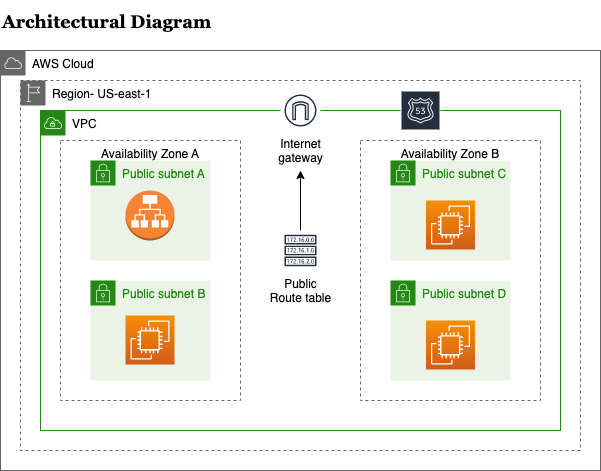
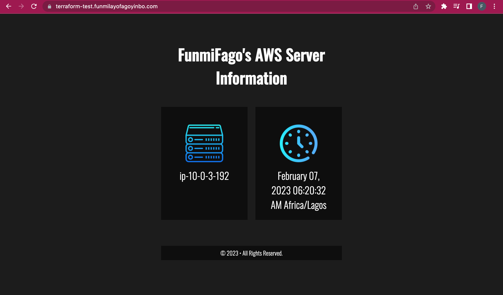

# Deploying 3 EC2 Instances behind a Load Balancer using Terraform

This is another mini-project from AltSchool that seeks to explore my understanding of deploying infrastructures with Terraform, an Infrastructure as Code Tool.

The instructions to the project has been shared in the [`instructions.txt`](instructions.txt) file located in the project's directory.

Below are the final images of the webpage served by the load balancer containing details of the server IP addresses and time using the subdomain.domain-name.com as specified.

Instructions for using repo:
1. Add the values of the variables defined in the `variable.tf` file
2. Run `terraform init` in the terraform directory
3. Followed by `terraform plan` to see the resources that will be deployed, then
4. `terraform apply` to generate the `ansible/host-inventory` file that will be used for the ansible configuration.
5. On the terminal, run `ansible all -m ping` to connect to the instances.
6. Run the ansible playbook with `ansible-playbook configuration.yml` to configure the servers.
7. When you visit the sub-domain name you specified, you will get the contents of the load balancer.

Happy Coding!!!